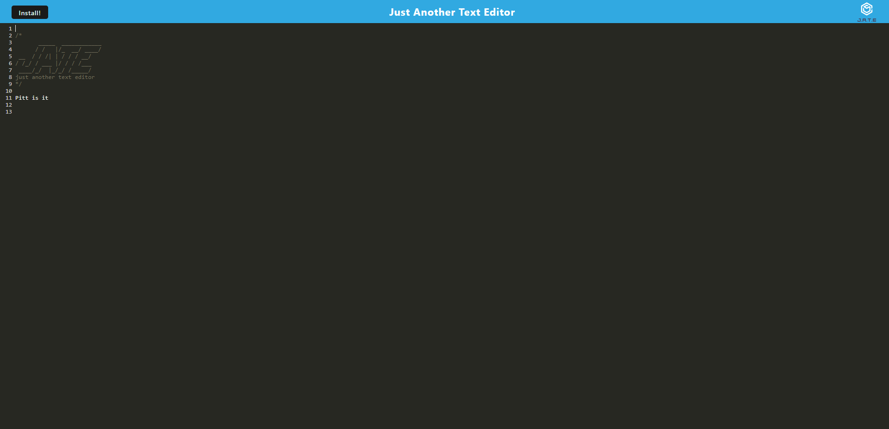

# Name
PWA: Text Editor

## Description
I created a progressive web application text editor that runs in the browser. It is a single page application that meets the PWA Criteria.

## Usage
You can utilize the heroku link to access the browser. Within the terminal, you can run "npm install". Then "npm run build" and lastly "npm run start:dev". This will allow you to access your localhost:3000 within the browser.

## Screenshot of My Project

## Link to My Project
<a href="https://jrettinger.github.io/text-editor/" target= blank>Link to my project</a>